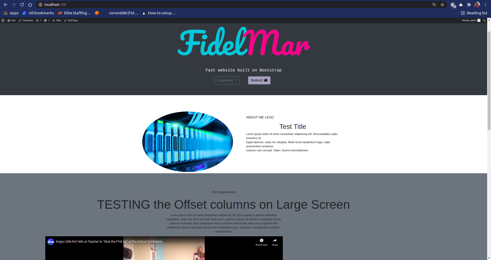

# wp-child
Folder used to hold child themes of things I create.

<b>PicoStrap Clone</b> added in a header section with a logo and buttons. <br>
Libraries: Bootstrap, Google Fonts, FontAwesome



twentychild; A child theme of twentytwentyone to practice making my own theme
[How to add new block patterns or template](#https://kinsta.com/blog/twenty-twenty-one-theme/#how-to-build-a-child-theme-on-twenty-twentyone)<br>


[Add bootstrap](https://www.greengeeks.com/blog/bootstrap-wordpress/)
[Add FontAwesome](#)
```
    <link rel="stylesheet" href="https://use.fontawesome.com/releases/v5.15.3/css/all.css" integrity="sha384-SZXxX4whJ79/gErwcOYf+zWLeJdY/qpuqC4cAa9rOGUstPomtqpuNWT9wdPEn2fk" crossorigin="anonymous">

<i class="fa fa-home"></i>

```

### Wordpress Themes I Enjoy
[Reddit good free starter themes](https://www.reddit.com/r/Wordpress/comments/mxq8cb/i_see_a_lot_of_requests_for_good_free_themes_so_i/)
* picostrap
* GeneratePress
* astra

<b>Themes Tried</b>
* Calliope (lobosecurity)
* colibri wp
* neve
* consulting
* vantage
* hestia
* architect design
* artistic blog

<b>Veerotech themes</b>
* decor
* management
* pharmacy
* dentalcare


### Wordpress React

[Wordpress React Tutorial](https://www.iamtimsmith.com/blog/using-wordpress-with-react) Doesnt work followed it.

## ToDO
* [x] header.php overwrites the header in original theme 
* [x] style.css create styles that overwrite original file
  * [x] import google fonts
  * [x] set a background image in header
* [x] functions.php
  * [x] call function that reads old style and reads new styles
* [ ] Finish creating Picostrap child theme
  * [x] Create a copy of picostrap website headers under picostrap-clone
  * [] Create a sample home page 
